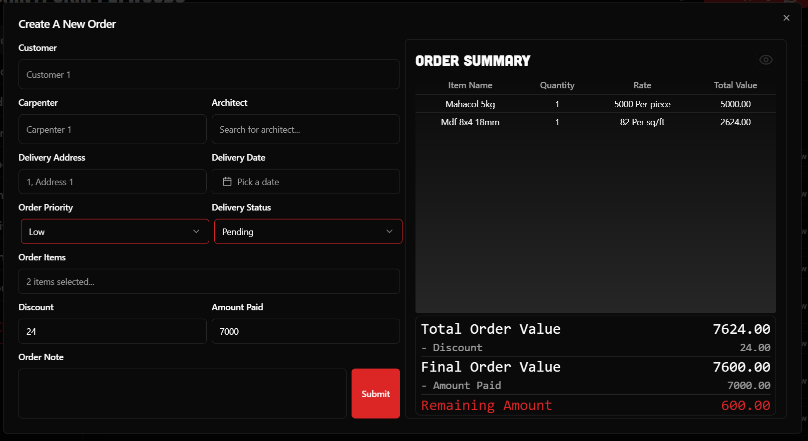
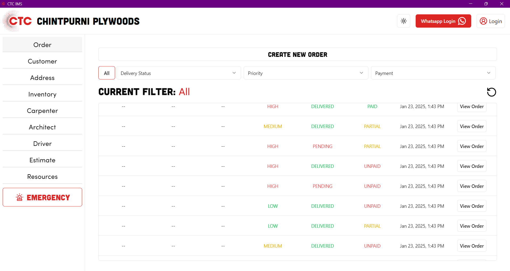

# CTC IMS

CTC IMS is an open sourced zero trust(*almost) inventory manangement system tailored for Indian businesses needs.

---

## Core Features

| Feature | Graphics |
|------------------|------------------|
| Whatsapp Web Integration |  <video src="https://github.com/user-attachments/assets/31e7e6e7-7850-4a9f-a155-beccae514230">  |
| Customer Management |  |
| Customer Address Lat Long  |   |
| Multi Phone/Address Per Customer  |  <video src="https://github.com/user-attachments/assets/2a4fdb29-a9f6-4f89-a54e-ce86399c9007">  |
| Search Customer  |  <video src="https://github.com/user-attachments/assets/e1fa4a41-284a-4032-85be-6622ff748c28">  |
| Search Address by Name/Area  |  <video src="https://github.com/user-attachments/assets/98cf0be4-8b70-4fee-aa40-8c36173ba5cd">  |
| Low Stock Inventory Notification  |  <video src="https://github.com/user-attachments/assets/682ddc77-b183-43a3-94fb-a9dba4dbc536">  |
| Filter / Search Inventory  |  <video src="https://github.com/user-attachments/assets/fd621859-5f1e-4917-a23c-5e68e4992950">  |
| Multi Warehouse Inventory  |  <video src="https://github.com/user-attachments/assets/36790028-71fb-4cd6-8191-58e0fc10d3a7">  |
| Carpenter/Architect Commission  |  <video src="https://github.com/user-attachments/assets/ccc8a254-9785-4bfb-8817-3404f246ba53">  |
| Estimate Creation  |  <video src="https://github.com/user-attachments/assets/b9ff2065-19e9-4e74-b840-c4cb178441bc">  |
| Documents Saving  |  <video src="https://github.com/user-attachments/assets/3396c764-1728-4809-aaed-e6d139c8cbae">  |
| Filter Orders  |  <video src="https://github.com/user-attachments/assets/3f36ef98-b59b-4aab-8b0e-a8fb4ca07a6b">  |
| Edit Order  |  <video src="https://github.com/user-attachments/assets/e3e8b446-079f-4f77-90b8-4d16bcea19a5">  |
| View Order Deliveries & Returns  |  <video src="https://github.com/user-attachments/assets/b65409bf-108d-401a-a6d2-4915e715522b">  |
| Print & Upload Order Recipts  |  <video src="https://github.com/user-attachments/assets/ec18e905-191f-4829-b530-03d3ed390f45">  |
| Create Order Interface  |  |
| View Logs  |  <video src="https://github.com/user-attachments/assets/ed65f5b7-e193-490e-ad6a-eff165af351e"> |
| Dark/Light Mode  |  |

## System Capabilities / Quality Attributes

| Feature | Graphics |
|------------------|------------------|
| Splash Screen |  <video src="https://github.com/user-attachments/assets/4cc8473e-f56f-4e3a-af8a-826f62d4c26b">  |
| Cursor Pagination |  <video src="https://github.com/user-attachments/assets/4136e326-57c6-4774-ab45-8aac2634f349">  |
| Table Virtualization |  <video src="https://github.com/user-attachments/assets/446f2023-7e18-4079-b54b-bb1dcc7e2d4f">  |
| Auth.js Authentication | *No Graphics Available* |
| Forms Using React Hook Form | *No Graphics Available* |
| Zod Validation | *No Graphics Available* |
| Monorepo | *No Graphics Available* |
| Db Seed & Clear Scripts | *No Graphics Available* |
| Custom PSQL Triggers | *No Graphics Available* |
| Backend on Lambda Functions | *No Graphics Available* |
| Cross Platform (Windows/Mac/Linux) | *No Graphics Available* |
| Deployed using IaC (SST) | *No Graphics Available* |

---

### *Please note that this IMS is not complete yet, some things are left to do that are mentioned in [TODO File](./todo.md)*
